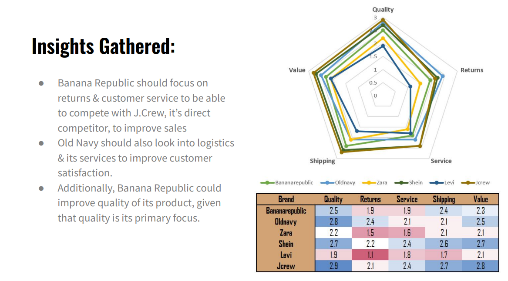
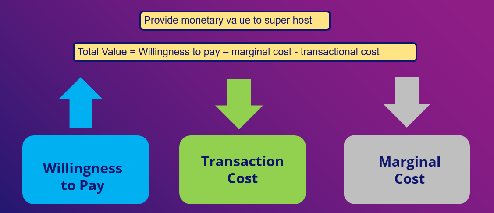
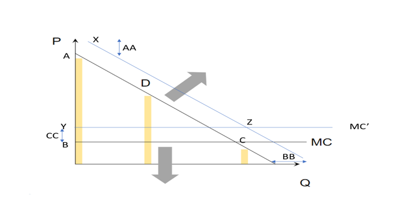
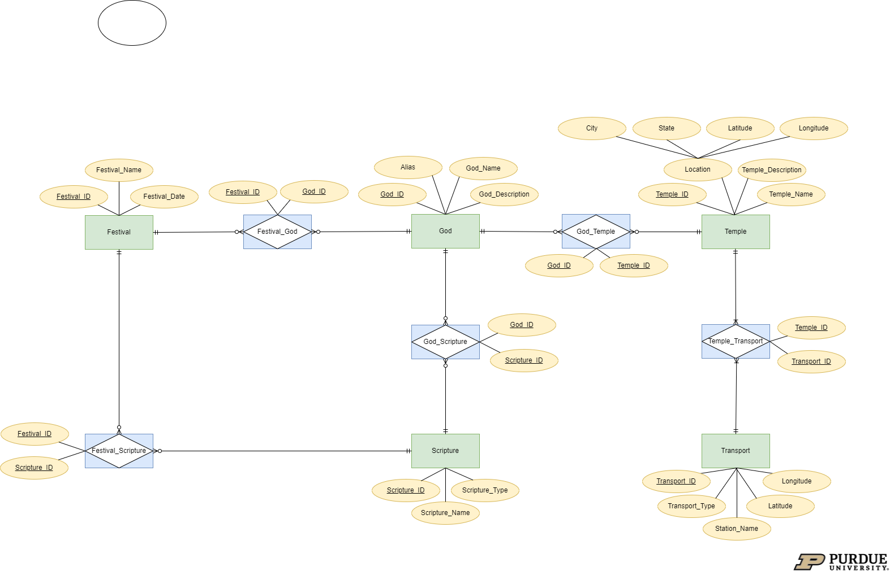
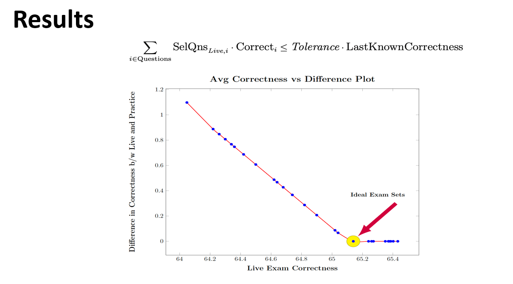
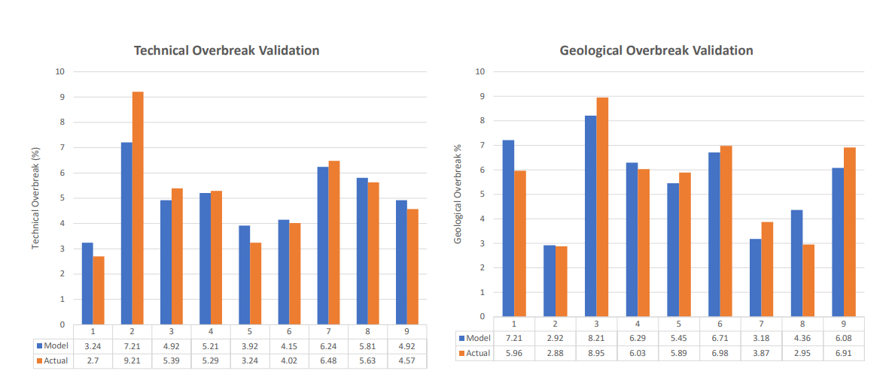
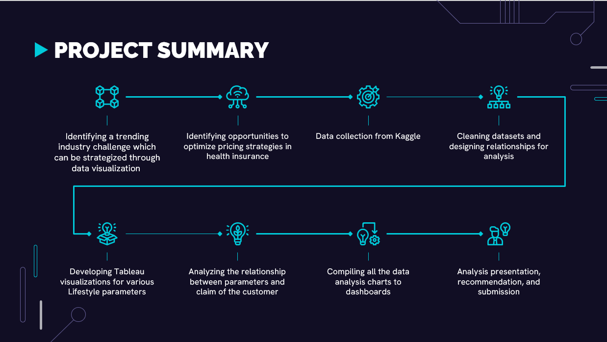
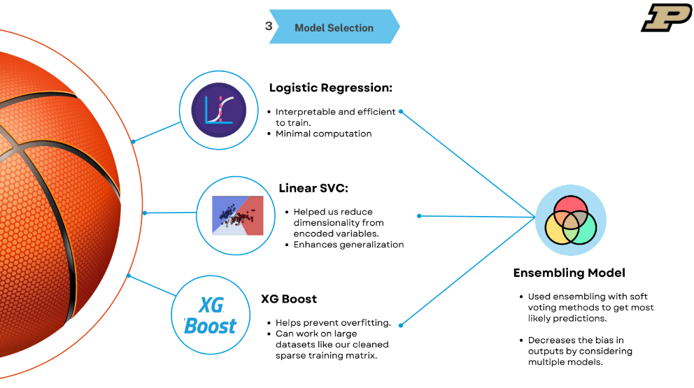

# Engineering Operations Analyst

#### Technical Skills: MySQL, Python, R, C, Tableau, Power BI, JIRA, SAS EM, SAS, Excel, PowerPoint, Minitab, Azure, AWS.

## Work Experience
**Analytics Consultant Intern @ Kearney (_Jan 2024 - Present_)**

•	Redesigned a domestic supply chain network for a leading automobile company to cater to the rise of demand, thereby developing the optimal location strategy resilient to market dynamics like labor and transportation.

**Operations Analyst @ Larsen & Toubro (_July 2021 - June 2023_)**

•	Developed project monitoring dashboards to report 15 budget and schedule KPIs daily, weekly, and monthly. This supported management decision-making and reduced the planner's hours by 20%.

•	Created and managed project timelines for a large-scale engineering project using ERP tools, leading to a 13% improvement in forecasting material schedules which led to an 8% reduction in procurement costs.

•	Analyzed historical trends of similar commercial mining projects to estimate manpower for differing activities using multiple linear regression which successfully helped in the reduction of excess labor by 8%.

•	Assisted a cross-functional team of 4 in implementing an automation of a manual process in tunnel mining which resulted in a reduction of the cycle time of tunnel boring by 20%.

•	Led a team of 5 in implementing data envelopment analysis techniques to assess resource efficiency across 6 different sites and identified potential monetary opportunities spanning from $150k to $1M annually.

## Projects 
### Big data impact at Gap
 
 This project delves into the transformative decision by GAP Inc. to shift to a data-driven creative process. Analyzing customer reviews, product satisfaction, and 
 industry benchmarks, we assess the impact of this strategic move. Key findings emphasize the nuanced role of big data, advocating for a balanced approach that 
 integrates creative input for optimal results. The project structure includes data analysis scripts, results, and presentations, providing a comprehensive 
 understanding of the analysis process. With actionable insights, this case study guides companies like GAP toward enhanced customer satisfaction and increased 
 sales.
 
 [Read full report](https://github.com/vishnuponduri1/impact-of-bigdata-on-gap-clothing)
 

### Airbnb superhost criteria evaluation
 
 This Airbnb-focused project delves into critical business challenges to enhance decision-making for both hosts and the platform. The evaluation of Airbnb's 
 superhost status reveals that the current criteria show limited impact on bookings, prompting a proposal for restructuring to provide tangible monetary benefits 
 and boost overall platform bookings. Additionally, a tract-level analysis identifies factors influencing average bookings, with a focus on the number of hosts in 
 a tract and superhost-related interactions. The project suggests revising the superhost system alongside data-driven strategies to empower hosts, aiming for a 
 more lucrative and efficient platform while ensuring an improved and reliable service for Airbnb guests.
 [Read full report](https://github.com/vishnuponduri1/Airbnb-superhost-criteria-evaluation)
     
 
### Database development for a app - Darshan
 
 In the ever-evolving landscape of spiritual devotion, the Darshan App serves as a guiding beacon for India's spiritually inclined population. However, hindered by 
 its reliance on a legacy Microsoft Excel database, the app seeks a transformative upgrade through this project. The goal is to develop a sophisticated database 
 that efficiently manages Darshan's diverse resources, transcending the limitations of its current system. This upgrade promises an enriched user experience, 
 improved SEO, and innovative features like a festival calendar. The accompanying Entity-Relationship Diagram visualizes the intricate connections within the 
 database, ensuring precision and reliability. This project marks a crucial stride in Darshan's evolution, ushering in a modern database infrastructure to elevate 
 the spiritual journey for users.
 [Read full report](https://github.com/vishnuponduri1/database-creation-for-an-app)
  
 
### Sas optimisation for designing a balanced set of questions
 
 This project aims to optimize the creation of two sets of 50-question papers for a professor, adhering to specific constraints. With 308 decision variables and 
 various constraints, the objective is to minimize the difference in easiness between the two sets while considering historical correctness percentages. 
 Linearization techniques are employed for solvability, and assumptions include correlating low correctness with higher difficulty. The output provides the 
 professor with well-balanced question papers, enhancing the potential for automated computerized exams in the future.
 [Read full report](https://github.com/vishnuponduri1/optimisation-on-SAS-platform-to-create-balanced-question-paper)
  
 
### Machine learning techniques to minimise tunnel overbreak (common tunnelling problem)

 The project focuses on analyzing and optimizing overbreak issues in drill and blast tunneling at a live site, RVNL Package 2 in Rishikesh. Utilizing Rock 
 Engineering Solution (RES), we developed an Overbreak Index and a predicting model validated on site data. Control blasting techniques, such as smooth blasting 
 and pre-splitting, were applied, resulting in a 4% to 13% reduction in overbreak. The study also considered factors like delay time, advancement factor, and 
 confinement factor, providing valuable insights for risk mitigation and improved tunneling practices
 [Read full report](https://github.com/vishnuponduri1/using-classic-machine-learning-to-counter-tunnelling-problems)
  

### Health insurance pricing and risk analysis
 
 This health insurance cost analysis project delves into three datasets—Cardiovascular Diseases Risk Prediction, US Health Insurance, and Region-wise Obesity 
 Prevalence—to provide insights for insurance providers. The data story covers BMI sensitivity, state-wise patterns, and exploratory health analysis. Key concepts 
 include BMI distribution, color-coded gender-based BMI analysis, state-wise heatmaps, and average claims comparison. Recommendations focus on gender-based 
 pricing, lifestyle encouragement, diabetes impact assessment, and region-specific policies. Despite dataset limitations, the project offers strategic insights for 
 refining insurance strategies and promoting healthier living
 [Read full report](https://github.com/vishnuponduri1/health-insuarnce-pricing-and-risk-analysis)
 

  **NCAA Basketball ticket purchase analysis**

In this endeavor, we utilized predictive analytics to transform the approach to ticket sales for Women’s NCAA Basketball. Our analysis was centered on predicting purchasing patterns to boost ticket sales, merging customer data with external datasets to ensure precision. Our objective was to create predictive models that identify customer ticket purchases and whether they originate from the primary or secondary market. The initiative was designed to maximize revenue, streamline operations, and enhance the fan experience. By conducting thorough data preprocessing and employing advanced modeling techniques utilizing algorithms such as CatBoost and XGBoost, we developed strategies to improve loyalty programs and customer service. The project holds the potential for significant benefits to the NCAA, laying the groundwork for an integrated app-based system for user feedback and an enhanced overall experience.

Our project team, known as 'Green Light District', achieved the 1st position out of 51 competing teams in the Kaggle competition as part of the 'Crossroads Classic Analytics Challenge 24', attaining a prediction accuracy of 98.682% [Kaggle link](https://www.kaggle.com/competitions/crossroads-classic-analytics-challenge-24/leaderboard). Furthermore, we secured the 2nd position state wide in the finals held at NCAA headquarters. In the same competition we won 1st price in the state for the best presenation and visualisations.

Project link :[detail summary](https://drive.google.com/file/d/1yakqO2f-OjMH1ENZZ2cYGzTCRkplojQA/view?usp=sharing)

[Youtube video of the solution](https://youtu.be/wtrAa9xOLy8)

 **Multivariate-Time-Series-Forecasting-Evaluating-Price-Prediction-of-Cryptocurrencies**

The goal of this project is to predict Bitcoin returns for a 15-minute interval from the current period, both independently and in conjunction with other major cryptocurrencies such as Ethereum and ESO.IO. Through exploratory data analysis, data preprocessing techniques, and the utilization of LSTM models, we delve into the complexities of cryptocurrency price movements in an effort to anticipate Bitcoin's short-term returns.
The main objective is to forecast the 15-minute returns of cryptocurrencies from the present period using the following approaches:

Bitcoin data alone. A combination of Bitcoin and Ethereum data. A combination of Bitcoin and EOS.IO data. This initiative aims to examine how incorporating multiple cryptocurrencies with different co-relations affects the accuracy of Bitcoin return predictions.

As expected, a diverse set of stocks were able to generalise the model better than the model only with co-related stocks. Increase in sequence length did not necessarily decrease the prediction error. 

